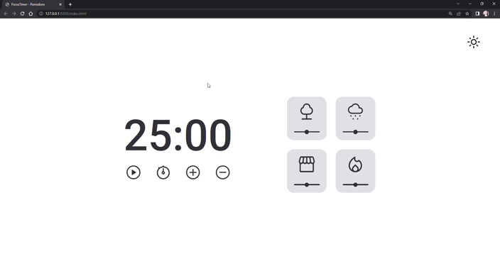

# Explorer RocketSeat - Focus Timer Dark Mode

Controlador de tempo com sons, volume e modo noturno

[👉Clique aqui para acessar](https://myllenaff.github.io/FocusTimer_DarkMode/)

## 💻 Tecnologias:

- HTML
- CSS
- JavaScript
- Git e Github
- Figma

## ❤ Contato:

myllenaff@gmail.com
# Projeto Focus Timer - Dark Mode!